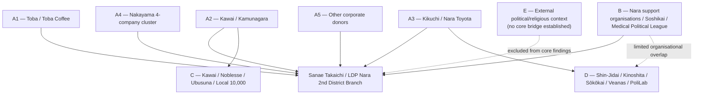
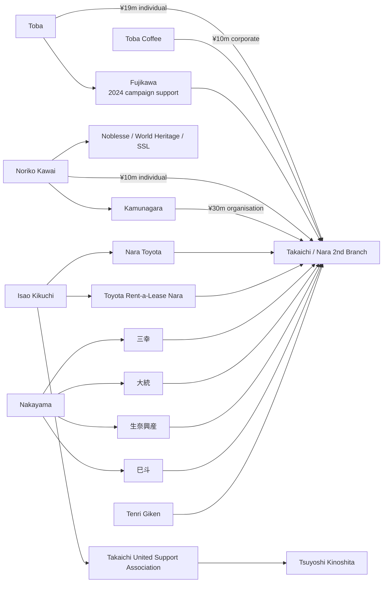
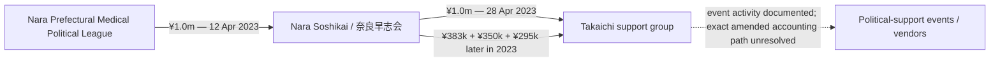
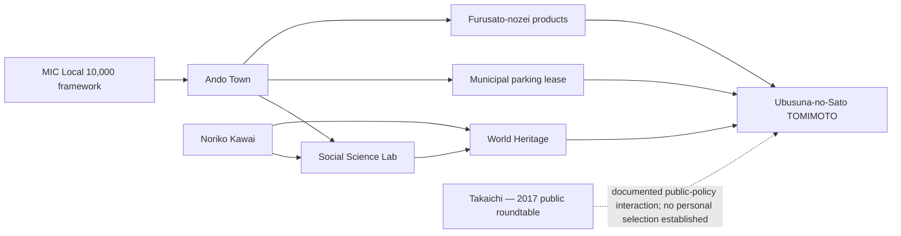
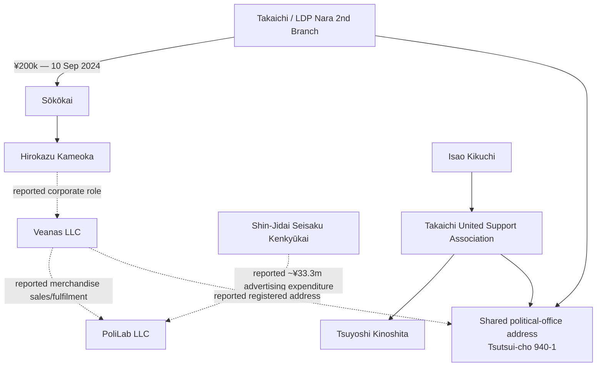

# JAPAN — PROJECT BLACKBIRD

# JP-02 — TAKAICHI POLITICAL-FUNDING NETWORK — PUBLIC EDITION

**A Public-Record OSINT Case Study of Political Donations, Support Organisations, Business/Public-Sector Intersections, Vendor Relationships, and Evidentiary Limits in Japan**

| Field | Value |
|---|---|
| Country | Japan |
| Case Reference | JP-02 |
| Prepared by | Ninomae Tsukumo |
| Purpose | Personal research and educational study |
| Classification | Open Source / Unclassified |
| Research Cut-Off | 17 September 2026 |
| Case Status | Closed to broad discovery / publication-reviewed |
| Edition | Public / privacy-reviewed |
| Language | English |

## IMPORTANT NOTICE

This report is an independent open-source intelligence case study. It was not prepared for a political party, candidate, campaign, regulator, law-enforcement authority, media organisation, client, donor, business, religious body, advocacy group, or electoral purpose.

The report does **not** determine criminal, civil, electoral, tax, regulatory, or ethical liability. A political donation, shared address, support-group role, personal relationship, government contract, public-program participation, business relationship, correction, refund, amendment, or criminal complaint does not by itself establish misconduct.

Where allegations were publicly made, this report distinguishes the underlying record from the allegation, the evidence cited, later scrutiny, the subject response, corrections or refunds, and any known legal disposition.

This public edition excludes unrelated private information, private family details, private addresses, unsupported identity matches, and person-level material that is not necessary to understand the documented political-funding network.

# BOTTOM LINE UP FRONT

JP-02 found a **multi-cluster political-funding environment** around Sanae Takaichi-linked organisations in Nara. The strongest evidence is documentary: political-funds reports identify donations, transfers, officers, addresses, and support organisations; official and corporate records document selected business and public-sector relationships; Diet records document later scrutiny and responses.

The evidence does **not** support reducing the case to one unified donor network. Repeated targeted searches found several clusters that converge on the same political recipient but do not otherwise connect to one another.

The principal clusters at closure are:

1. **Hiromichi Toba / Toba Coffee** — large 2024 donations and active campaign support involving election strategist Shinnosuke Fujikawa.
2. **Noriko Kawai / Kamunagara / Noblesse** — a longer-standing relationship with Takaichi and a separate business/public-policy history around Ubusuna-no-Sato TOMIMOTO and the Local 10,000 Project.
3. **Isao Kikuchi / Nara Toyota / Takaichi United Support Association** — a long documented personal relationship plus formal support-group infrastructure through Tsuyoshi Kinoshita.
4. **Masateru Nakayama / four-company donor cluster** — four companies sharing the same listed representative, address, date, and ¥2.5 million donation amount in the 2024 branch filing.
5. **Other corporate donor clusters**, including two 上武建設 entries and Tenri Giken.
6. **Political-support infrastructure** involving Nara Soshikai, the Nara Prefectural Medical Political League, Noriaki Ando, a large 2024 support event, dissolution, and later historical-report corrections.
7. **Shin-Jidai / Sōkōkai / Kameoka / Veanas / PoliLab-related infrastructure** — real personnel, address, and reported vendor links exist, but no improper financial loop has been established.

At closure, the record supports a **spider-web model of partially connected clusters**. It does not establish quid pro quo, a common hidden controller, circular funding, private enrichment, or a single coordinated donor machine.

# 1. PURPOSE AND SCOPE

## 1.1 Principal intelligence requirement

> What can public records establish about the political-funding, support-organisation, donor, business, and public-sector relationships surrounding Takaichi-linked political organisations, and which proposed connections survive verification?

## 1.2 Scope

The investigation focused on political-funds reports and amendment histories; donors and recipient entities; political support organisations; corporate and religious entities; public contracts and public-program relationships; documented personal, business, or organisational relationships; vendor and shared-address relationships; claim provenance; competing explanations; and negative findings.

## 1.3 Out of scope

Private communications, bank records, non-public tax returns, private beneficial ownership that is not lawfully public, unsupported motive claims, electoral persuasion, identity matching based only on common names, and legal conclusions beyond what competent authorities have established.

# 2. METHODOLOGY

## 2.1 Evidence model

| Classification | Meaning |
|---|---|
| **Verified Fact** | Directly supported by strong primary documentation. |
| **Corroborated** | Supported by multiple reliable sources, including primary material where available. |
| **Reported Information** | Publicly reported but not independently established from the underlying primary record. |
| **Analytical Judgment** | Interpretation based on established facts. |
| **Hypothesis** | Possible explanation that remains unproven. |
| **Negative Finding** | A defined public-source search did not establish the proposed relationship. |
| **Unknown / Unresolved** | Available evidence is insufficient to determine the answer. |

**Core rule:** source ≠ claim ≠ fact ≠ conclusion.

## 2.2 Network rule

Shared officers, addresses, dates, industries, vendors, events, or political recipients justify investigation, but do not by themselves prove common ownership, coordination, pass-through funding, improper influence, or criminal intent.

## 2.3 Claim-provenance rule

For disputed matters, JP-02 separates the underlying filing or record; the earliest public claim located; the exact allegation; the evidence cited; later repetition or official scrutiny; the subject response; amendments, refunds, or corrections; any prosecutorial, regulatory, or judicial disposition; and the current evidentiary assessment.

## 2.4 AI-assisted OSINT

AI was used for query generation, entity extraction, Japanese-English comparison, document comparison, candidate prioritisation, timeline reconstruction, network mapping, and negative-finding tracking. AI output was not treated as evidence.

# 3. EVIDENCE VISUAL — CASE ARCHITECTURE



The graph is a relationship map, not an allegation map.

# 4. CORE POLITICAL ENTITY

The 2024 political-funds report for **自由民主党奈良県第二選挙区支部 — LDP Nara 2nd District Branch** lists Sanae Takaichi as representative and the office at 筒井町940-1 in Yamatokoriyama, Nara. It is the principal donor and expenditure record used in this case. **[SRC-0001]**

Nara Prefecture's filing index records later corrections on 28 and 30 November 2025. The current online version therefore should not automatically be treated as the untouched original publication. **[SRC-0002]**

# 5. DIRECT DONOR CLUSTERS

## 5.1 Hiromichi Toba / Toba Coffee

The 2024 filing records two individual donations from Hiromichi Toba totalling **¥19 million** and a **¥10 million** corporate donation from Toba Coffee. **[SRC-0001]**

In the Diet on 9 December 2025, Takaichi stated that the branch had received ¥10 million from a company subject to a ¥7.5 million annual limit and that ¥2.5 million was returned after the issue was identified. **[SRC-0003]**

The filing history and public explanation produced this sequence:

```text
¥10.0m received in 2024
      ↓
issue identified / ¥2.5m returned
      ↓
2024 filing first corrected to ¥7.5m
      ↓
accounting treatment reconsidered
      ↓
2024 filing restored to ¥10.0m received
refund to be shown as 2025 expenditure
```

Toba's relationship with Takaichi extended beyond donations. Toba publicly supported her 2024 LDP leadership campaign and stated that he personally asked election strategist **Shinnosuke Fujikawa** to support Takaichi. **[SRC-0014]**

JP-02 did not establish a specific public contract, subsidy, regulatory intervention, procurement decision, or other governmental benefit to Toba Coffee caused by these donations or campaign support.

## 5.2 Noriko Kawai / Kamunagara

The same filing records **Noriko Kawai — ¥10 million individual donation** and **religious corporation Kamunagara / 神奈我良 — ¥30 million organisational donation**, with Kawai in the representative field associated with the Kamunagara entry. **[SRC-0001]**

Kawai's relationship with Takaichi predates the 2024 donations. Public material documents a **2017 roundtable** involving then-Internal Affairs Minister Takaichi, Ando Mayor Yasuhiro Nishimoto, and Kawai concerning Ubusuna-no-Sato TOMIMOTO and regional revitalisation. **[SRC-0009]**

Secondary reporting also describes an earlier personal relationship, but JP-02 did not recover the original contemporaneous source for the “older-sister” wording, so that wording is not used as a primary finding.

## 5.3 Isao Kikuchi / Nara Toyota support ecosystem

Official support-association records identify **菊池 攻 (Isao Kikuchi)** as representative of **高市早苗連合後援会 — Takaichi United Support Association** and **木下 剛志 (Tsuyoshi Kinoshita)** as accounting officer and administrative contact. The organisation uses the same 筒井町940-1 political-office address. **[SRC-0005]**

Independent automotive-industry reporting describes Kikuchi and Takaichi as having known each other for more than three decades and identifies Kikuchi as a long-term support-association leader. **[SRC-0015]**

Nara Toyota and Toyota Rent-a-Lease Nara also appear in the donor-side record. Combined with Kikuchi's formal support-group role, this creates a documented bridge from a corporate-support cluster into the Takaichi political-office infrastructure. It does not establish preferential treatment or improper influence.

## 5.4 Nakayama four-company cluster

The official 2024 branch filing records four donations on **23 August 2024**:

| Company | Amount | Listed representative | Date |
|---|---:|---|---|
| 三幸（株） | ¥2,500,000 | 中山雅照 | 23 Aug 2024 |
| 大統（株） | ¥2,500,000 | 中山雅照 | 23 Aug 2024 |
| 生奈興産（株） | ¥2,500,000 | 中山雅照 | 23 Aug 2024 |
| 巳斗（株） | ¥2,500,000 | 中山雅照 | 23 Aug 2024 |
| **Aggregate** | **¥10,000,000** | — | — |

The rows also share the same listed address. **[SRC-0001]**

This is a source-supported internal donor cluster. Business-location research connects the address to the Miyuki / Triple Star pachinko-business environment, but JP-02 did not obtain registry-level ownership evidence proving the precise parent/subsidiary or shareholding relationship among all four entities.

The same-date/equal-amount pattern is recorded as a structural fact only. JP-02 does not characterise it as unlawful donation splitting or evasion.

Repeated searches did not establish a supported bridge from this cluster to Toba, Kawai, Kikuchi, Ando, Kinoshita, Kameoka, Veanas, Sōkōkai, or Shin-Jidai.

## 5.5 上武建設 entries

The 2024 branch filing records two 上武建設 entries on 23 August 2024: **¥500,000** under 上武尚宏 and **¥1,500,000** under 上武建一. The rows use different listed representatives/addresses. **[SRC-0001]**

Separate Nara Prefecture records confirm 上武建設株式会社 as a construction-sector participant headed by 上武建一. **[SRC-0013]**

No supported bridge from this cluster into Branch B, C, D, or E was established.

## 5.6 Tenri Giken and government-contract context

Reporting based on the branch filing records a **¥200,000** donation from Tenri Giken on 19 September 2024. Separate reporting identified an active **¥25.44 million** Kinki Regional Development Bureau survey contract running from 16 May 2024 to 31 March 2025. **[SRC-0016]**

The same reporting discussed donations by Nara Toyota and Toyota Rent-a-Lease Nara while those companies also held national-government contracts. A later criminal complaint alleged that the donations fell within an election-law restriction applicable to certain government contractors. **[SRC-0016]**

The contract dates and donation dates are relevant facts. The complaint is an allegation. JP-02 did not locate an adjudicated finding establishing a violation as of the research cut-off.

# 6. EVIDENCE VISUAL — DONOR-SIDE MAP



The diagram intentionally does **not** draw unsupported donor-to-donor bridges.

# 7. DONOR-TO-DONOR NETWORK TESTING

Repeated targeted searches did **not** establish meaningful direct links among several principal donor tracks, including Toba ↔ Kawai / Kamunagara; Toba ↔ Kikuchi / Nara Toyota; Toba ↔ Tenri Giken; Kikuchi / Nara Toyota ↔ Kawai / Noblesse; Kikuchi / Nara Toyota ↔ Tenri Giken; Nakayama cluster ↔ Toba / Kawai / Kikuchi / Ando / Kinoshita / Kameoka; 上武建設 ↔ Kawai / Noblesse; and Tenri Giken ↔ Branch B / C / D nodes.

These are **negative findings**, not proof that private relationships do not exist.

# 8. BRANCH B — POLITICAL-SUPPORT ORGANISATION STRUCTURE

JP-02 separately examined Nara support organisations involving **Noriaki Ando**, **奈良早志会**, and the **Nara Prefectural Medical Political League**.

The original 2023 奈良早志会 filing records:

- **12 Apr 2023:** Nara Prefectural Medical Political League → **¥1,000,000** → 奈良早志会;
- **28 Apr 2023:** 奈良早志会 → **¥1,000,000** → the Takaichi support group;
- additional 2023 support-group donations of **¥383,000, ¥350,000, and ¥295,000**;
- total 2023 奈良早志会 → support-group transfers: **¥2,028,000**. **[SRC-0006]**

The matching ¥1 million amounts and sixteen-day interval establish a transaction sequence. They do **not** establish that the exact same money was passed through, that the structure was designed to conceal source/destination, or that unlawful coordination occurred.

The Nara Medical Association and the Nara Prefectural Medical Political League are legally and organisationally distinct and are treated separately throughout JP-02.

Nara Prefecture records later show 奈良早志会 dissolved before historical filings were corrected. The version history is analytically important, but post-dissolution correction does not itself establish falsity, concealment, or criminal intent. **[SRC-0008]**

## 8.1 Evidence visual — Branch B transaction sequence



# 9. BRANCH C — KAWAI / NOBLESSE / UBUSUNA PUBLIC-SECTOR INTERSECTION

Ubusuna-no-Sato TOMIMOTO is a regional tourism/hospitality redevelopment in Ando Town connected to **World Heritage** and **Social Science Lab** within the broader Kawai/Noblesse sphere.

Official and institutional materials confirm FY2015 use of the **MIC Local 10,000 Project** and later operation as accommodation, restaurant, and cultural-experience facilities. **[SRC-0009; SRC-0010]**

Ando Town records separately document historical public support for the former museum before the Kawai-linked redevelopment; a later **100 m² municipal land lease for parking**; Social Science Lab's FY2016 town-centre revitalisation planning work; later integration of Ubusuna products into Ando Town furusato-nozei return gifts; and later municipal recognition of Kawai's local contribution.

The former museum had received management/operating subsidies over FY1975–FY2011 totalling **¥35.7 million**. That historical support predates the later redevelopment and must not be attributed to Kawai or Noblesse. **[SRC-0010]**

## 9.1 Takaichi connection

Verified: Takaichi was Internal Affairs Minister during the relevant period; the project used the Local 10,000 framework; and Takaichi, Mayor Nishimoto, and Kawai appeared together in a 2017 regional-revitalisation feature. **[SRC-0009]**

Not established: that Takaichi personally selected the project; directed the expert review or grant decision; caused preferential treatment because of political support; or that 2024 donations were consideration for earlier public support.

## 9.2 KPI / evaluation gap

JP-02 did not recover the original Local 10,000 application KPI sheet, exact grant/finance package, or a consistent comparable post-opening series covering total footfall, lodging occupancy, restaurant customers, attributable jobs, project sales, local tax effects, tourism expenditure, or subsidy-return measures.

This is an **evaluation gap**, not evidence of concealment.

## 9.3 Evidence visual — public-benefit chain



# 10. BRANCH D — SHIN-JIDAI / KINOSHITA / SŌKŌKAI / VEANAS / POLILAB

## 10.1 Separate 2021–2022 classification allegation

JP-02 tracks a separate allegation concerning approximately ¥2.1 million in 2021–2022 political receipts said by a complainant to have been fundraising-party ticket revenue but reported as donations involving the LDP Nara 2nd District Branch / Shin-Jidai Seisaku Kenkyūkai. This issue is distinct from the roughly ¥2.0 million-plus 奈良早志会/support-group flows in Branch B.

The public edition preserves the allegation as a separate claim requiring primary transaction and legal-resolution evidence.

## 10.2 Sōkōkai / Hirokazu Kameoka

The official 2024 political-funds report for **創高会 — Sōkōkai** lists representative **Hikaru Kajii**, accounting officer / administrative contact **Hirokazu Kameoka**, and a **¥200,000 contribution from the LDP Nara 2nd District Branch on 10 September 2024**. **[SRC-0011]**

An official LDP youth record also identifies Kajii in the Nara youth organisation in 2020. **[SRC-0012]**

## 10.3 Veanas

Corporate-registry aggregation identifies Kameoka as representative member of **Veanas合同会社**, incorporated in December 2025, with the registered address reported as 筒井町940-1. Other reported executive members are Masaki Yamada, Yutaka Inamoto, and Kaname Yamaji. Direct commercial-register preservation remains an unresolved primary-source upgrade. **[SRC-0017]**

The address is significant because official political-funds records independently place Takaichi-linked political organisations at the same address. Shared address establishes co-location, not shared finances or ownership.

## 10.4 PoliLab

Secondary reporting states that **PoliLab合同会社** handled sales/fulfilment for Veanas merchandise and separately reports that **Shin-Jidai Seisaku Kenkyūkai paid PoliLab approximately ¥33.3 million in September 2024** as advertising-related expenditure. **[SRC-0018]**

JP-02 has not independently preserved the exact primary Shin-Jidai expenditure row or resolved every similarly named PoliLab entity. Veanas revenue flowing to a Takaichi political organisation and circular funding are **not established**.

## 10.5 Evidence visual — address/personnel/vendor branch



Solid arrows represent primary-record relationships. Dashed arrows represent relationships still dependent on secondary/corporate-registry aggregation or primary-source upgrades.

# 11. EXTERNAL POLITICAL / RELIGIOUS CONTEXT

Targeted searches tested possible links to external political or religious actors, including Sanseitō-related leads. No sufficiently supported donor-side or organisational bridge was established from the core JP-02 clusters. Material without a transaction, shared officer, formal organisational relationship, or comparable meaningful edge is therefore **excluded from the core public findings**.

# 12. WHAT THE EVIDENCE ESTABLISHES — AND WHAT IT DOES NOT

| Evidence | Establishes | Does not establish |
|---|---|---|
| Political-funds donation row | disclosed receipt, date, amount, donor fields | motive, quid pro quo, hidden source |
| Shared officer | organisational overlap | unlawful coordination |
| Shared political-office address | co-location | common ownership or common bank account |
| Government contract + donation timing | chronological overlap | automatic legal violation or favour |
| Filing correction/refund | record changed / money returned | intent, concealment, guilt |
| Criminal complaint | allegation submitted | acceptance, indictment, conviction |
| Public-program participation | benefit under a public framework | ministerial personal selection |
| Same-date equal donations by related companies | structural donor cluster | unlawful splitting without further evidence |
| Repeated failed cross-link searches | no public connection established in defined searches | proof that no private connection exists |

# 13. COMPETING EXPLANATIONS

The evidence is compatible with several ordinary and non-exclusive explanations: different supporters independently backing the same politician; local business leaders participating in overlapping civic or political networks without acting as one coordinated group; political organisations sharing staff or office infrastructure for administrative reasons; vendors serving political entities on commercial terms; corrections reflecting accounting treatment disputes rather than concealment; and public-program participation reflecting ordinary program procedures rather than donor influence.

Alternative explanations do not prove that every action was proper. They prevent timing, proximity, or association from being treated as proof of misconduct.

# 14. NEGATIVE FINDINGS

Public-source research did **not** establish a single unified donor network linking all major donors; direct Toba ↔ Kawai/Kamunagara ties; direct Toba ↔ Kikuchi/Nara Toyota ties; a meaningful Nakayama-cluster bridge to Branch B/C/D/E; a meaningful 上武建設 bridge to Branch B/C/D/E; a meaningful Tenri Giken bridge to other major donor/support clusters; quid pro quo between Kawai/Noblesse-related public benefits and later donations; evidence that Takaichi personally selected the Ubusuna Local 10,000 project; circular funding between Veanas, PoliLab, and Shin-Jidai; common beneficial ownership of the Nakayama companies merely from shared representative/address data; criminal intent from the Toba Coffee over-limit receipt and later refund; criminal liability merely because complaints were filed; or a core JP-02 link to Sanseitō or other external religious-political actors.

# 15. UNRESOLVED ITEMS PRESERVED AT CLOSURE

1. Recover the original and intermediate versions of the 2024 LDP Nara 2nd District Branch report.
2. Recover original-versus-amended 奈良早志会 filings and underlying receipts.
3. Obtain direct commercial-register extracts for Veanas and the Nakayama-linked companies.
4. Verify the exact PoliLab legal entity and primary Shin-Jidai expenditure row.
5. Recover the original Local 10,000 application, exact grant/finance package, and KPI sheet for Ubusuna.
6. Obtain primary land-registry/corporate-capital records for reported Kamunagara → World Heritage in-kind property transfers.
7. Resolve provisional donor rows such as Nitori Holdings before using them as public findings.
8. Record any future prosecutorial, regulatory, or judicial disposition concerning filed complaints.

# 16. CLOSURE ASSESSMENT

JP-02 is closed to broad discovery as of **17 September 2026**.

The investigation established a real and documentable political-funding environment with multiple donor, support, business/public-sector, and vendor clusters. Some clusters have meaningful bridges: Kawai/Kamunagara connects direct donations to the Noblesse/Ubusuna branch; Kikuchi connects corporate-support activity to the formal support-office infrastructure; Kameoka/Sōkōkai and shared-address evidence connect Veanas to the local political ecosystem at a personnel/space level.

At the same time, repeated targeted searches failed to establish many proposed donor-to-donor and cross-branch links. The public evidence therefore supports **partial connectivity**, not a single coordinated structure.

The unresolved items are now document-recovery or legal-disposition questions. Unless new primary evidence materially changes the map, additional broad searching would add noise rather than analytical value.

# 17. SOURCE REGISTER

## Primary / official sources

**[SRC-0001]** Nara Prefectural Election Administration Commission — 2024 political-funds report, 自由民主党奈良県第二選挙区支部.  
https://www.pref.nara.jp/secure/322314/R6_SS59.pdf

**[SRC-0002]** Nara Prefecture — official filing index showing correction history for the LDP Nara 2nd District Branch.

**[SRC-0003]** House of Representatives, Budget Committee, 9 December 2025 — Takaichi statement concerning the ¥10m corporate receipt, ¥7.5m applicable ceiling, and ¥2.5m return.  
https://www.shugiin.go.jp/internet/itdb_kaigiroku.nsf/html/kaigiroku/001821920251209006.htm

**[SRC-0004]** House of Representatives, Special Committee on Political Reform, 15 December 2025 — parliamentary discussion of the Kamunagara/Kawai donations.  
https://www.shugiin.go.jp/internet/itdb_kaigiroku.nsf/html/kaigiroku/034321920251215005.htm

**[SRC-0005]** Nara Prefectural Election Administration Commission — 2024 report, 高市早苗連合後援会.  
https://www.pref.nara.jp/secure/322332/R6_267.pdf

**[SRC-0006]** Nara Prefecture — preserved 2023 奈良早志会 political-funds report.  
https://www.pref.nara.lg.jp/documents/14048/r5_371.pdf

**[SRC-0007]** Nara Medical Association / Nara Medical Political League publication — 2023 material identifying Noriaki Ando's league role.

**[SRC-0008]** Nara Prefecture official gazette / political-funds disclosure index — 奈良早志会 dissolution and later historical-report correction chronology.

**[SRC-0009]** World Heritage / Noblesse / Noriko Kawai materials — 2017 regional-revitalisation roundtable involving Takaichi, Ando Mayor Nishimoto, and Kawai.  
https://www.worldheritage.co.jp/news/20170707-1

**[SRC-0010]** Ando Town / Nara Prefecture materials — Ubusuna / former museum / Local 10,000 / municipal-planning and post-project context.  
https://www.town.ando.nara.jp/cmsfiles/contents/0000003/3398/H26.6.6.pdf  
https://www.pref.nara.jp/secure/242807/shiryou2sankou_03.pdf  
https://www.town.ando.nara.jp/cmsfiles/contents/0000002/2940/shiryou1.pdf

**[SRC-0011]** Nara Prefectural Election Administration Commission — 2024 Sōkōkai political-funds report.  
https://www.pref.nara.jp/secure/322331/R6_265.pdf

**[SRC-0012]** Liberal Democratic Party — LDP youth record identifying Hikaru Kajii's Nara youth role.  
https://www.jimin.jp/youth/news/200815.html

**[SRC-0013]** Nara Prefecture public records — construction/procurement qualification material relevant to 上武建設 and other local contractors.

## Secondary / claim-origin / corroborating sources

**[SRC-0014]** Gendai Business — Hiromichi Toba interview / on-record statement concerning recruitment of Shinnosuke Fujikawa to support Takaichi's 2024 leadership campaign.

**[SRC-0015]** Japan Automobile Chamber — interview with Nara Toyota president Isao Kikuchi describing a 30+ year relationship with Takaichi and his support-association role.  
https://www.aba-j.or.jp/info/industry/24941/

**[SRC-0016]** JBpress — reporting on Nara Toyota, Toyota Rent-a-Lease Nara, and Tenri Giken donations, contemporaneous national-government contracts, and the later complaint.  
https://jbpress.ismedia.jp/articles/-/94091

**[SRC-0017]** Corporate-registry aggregation used for Veanas working officer/address mapping; direct commercial-register extract remains a closure-stage upgrade target.

**[SRC-0018]** 女性自身 / Jisin — reporting on Veanas merchandise fulfilment by PoliLab and the reported Shin-Jidai advertising expenditure.  
https://jisin.jp/domestic/2548898/

# 18. PUBLICATION / PRIVACY NOTE

The public edition names public political actors, disclosed donors, company representatives, and political-organisation officers only where identity is necessary to understand a documented public relationship. It omits unrelated private persons, private family information, personal contact details, private addresses, weak social-media proximity, and unsupported identity speculation.

No diagram in this report should be read as an allegation of misconduct. Diagrams summarise the evidentiary relationships described in the text and preserve the distinction between verified, corroborated, reported, and unresolved links.

---

**Ninomae Tsukumo**  
Project Blackbird  
JAPAN — JP-02  
Research cut-off: 17 September 2026