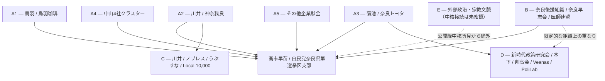
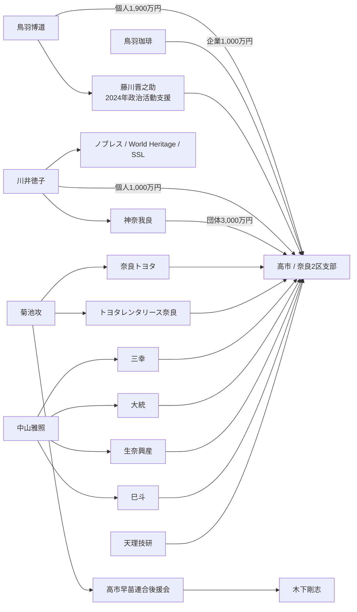
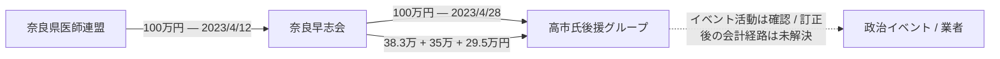
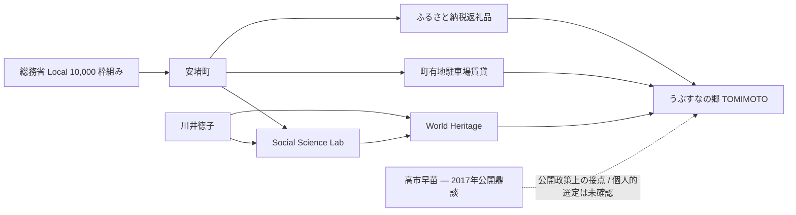
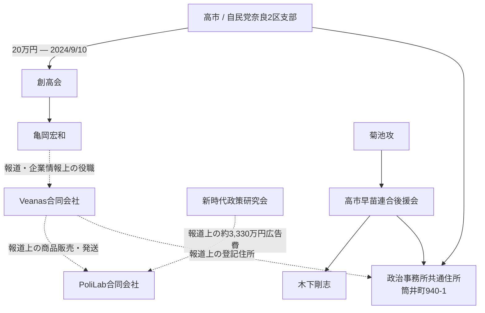

# JAPAN — PROJECT BLACKBIRD

# JP-02 — 高市早苗・政治資金ネットワーク — 公開版

**日本における政治献金、後援組織、企業・公共部門との接点、取引業者関係、および公開情報上の限界を検証するOSINT事例研究**

| 項目 | 内容 |
|---|---|
| 国 | 日本 |
| ケース番号 | JP-02 |
| 作成者 | Ninomae Tsukumo |
| 目的 | 個人研究・教育目的 |
| 分類 | Open Source / Unclassified |
| 調査基準日 | 2026年9月17日 |
| ケース状況 | 広範な探索を終了 / 公開審査済み |
| 版 | 公開版 / プライバシー審査済み |
| 言語 | 日本語 |

## 重要事項

本レポートは独立したオープンソース・インテリジェンス（OSINT）事例研究です。政党、候補者、選挙運動、規制当局、捜査機関、報道機関、依頼人、献金者、企業、宗教法人、圧力団体、または選挙目的のために作成したものではありません。

本レポートは、刑事、民事、選挙、税務、規制、倫理上の責任を認定するものではありません。政治献金、同一住所、後援会役職、個人的な関係、政府との契約、公的事業への参加、企業関係、訂正、返金、修正、刑事告発が存在するという事実だけで、不正行為が立証されるわけではありません。

公に提起された疑惑については、元となる記録、疑惑そのもの、提示された根拠、その後の国会等での検証、当事者の説明、訂正・返金、法的処分の有無を分離して扱います。

公開版では、分析に不要な私生活情報、家族情報、私人の住所、根拠の弱い人物同定、分析上不要な個人レベルの情報を除外しています。

# 要約（BOTTOM LINE UP FRONT）

JP-02では、奈良県を中心とする高市早苗氏関連政治団体の周辺に、**複数の部分的に接続した政治資金クラスター**が存在することを確認しました。最も強い証拠は公文書です。政治資金収支報告書は、献金、団体間移転、役員、所在地、後援団体を示し、行政・企業資料は一部の企業・公共部門関係を示し、国会記録は後日の追及と説明を確認します。

一方、これらを単一の統合された「献金ネットワーク」とみなす証拠は確認されませんでした。複数の献金者・団体は同じ政治的受領先に収束しますが、相互の直接的な関係が確認されないケースが多くあります。

調査終了時点の主なクラスターは以下のとおりです。

1. **鳥羽博道 / 鳥羽珈琲** — 2024年の大口献金と、選挙戦略家・藤川晋之助氏を通じた政治活動支援。
2. **川井徳子 / 神奈我良 / ノブレス** — より長期の人的関係と、「うぶすなの郷 TOMIMOTO」「ローカル10,000プロジェクト」を含む別系統の企業・公共政策接点。
3. **菊池攻 / 奈良トヨタ / 高市早苗連合後援会** — 長年の人的関係に加え、木下剛志氏を介した正式な後援会・事務所インフラとの接続。
4. **中山雅照 / 4社献金クラスター** — 2024年収支報告書で、同一代表者・同一住所・同一日・各250万円という4社の献金。
5. **その他の企業献金クラスター** — 上武建設の2件、天理技研など。
6. **政治後援組織インフラ** — 奈良早志会、奈良県医師連盟、安東範明氏、2024年大規模後援行事、解散、過年度報告の訂正。
7. **新時代政策研究会 / 創高会 / 亀岡宏和 / Veanas / PoliLab 関連インフラ** — 人員、所在地、業者関係の実在する接点がある一方、不適切な資金循環は確認されていません。

結論として、公開情報は**部分的につながる「蜘蛛の巣型」構造**を支持します。贈収賄的な対価関係、共通の隠れた支配者、循環資金、私的利益供与、単一の統制された献金システムは立証されていません。

# 1. 目的と範囲

## 1.1 主要インテリジェンス要件

> 高市早苗氏関連政治団体をめぐる政治資金、後援組織、献金者、企業、公共部門との関係について、公開記録から何を確立できるか。また、提案された接続のうち、検証に耐えるものはどれか。

## 1.2 調査対象

政治資金収支報告書と訂正履歴、献金者・受領団体、政治後援組織、企業・宗教法人、政府契約・公的事業との関係、文書化された人的・企業・組織関係、業者関係・同一住所関係、疑惑の出所、代替説明、ネガティブ・ファインディングを対象としました。

## 1.3 対象外

私的通信、銀行口座、非公開の税務申告、合法的に公開されていない実質的支配関係、根拠のない動機推測、選挙上の説得・候補者評価、同姓同名だけによる人物同定、裁判所・規制当局・関係機関が認定していない犯罪・違法性の断定。

# 2. 方法論

## 2.1 証拠分類

| 分類 | 意味 |
|---|---|
| **Verified Fact** | 強い一次資料で直接確認できる事実 |
| **Corroborated** | 複数の信頼できる資料で裏付けられる情報 |
| **Reported Information** | 報道されているが基礎一次資料を独立確認できていない情報 |
| **Analytical Judgment** | 確立した事実に基づく分析 |
| **Hypothesis** | 未立証の可能性のある説明 |
| **Negative Finding** | 定義した公開情報調査で提案された関係を確認できなかったこと |
| **Unknown / Unresolved** | 利用可能な証拠では判断できない事項 |

**基本原則:** source ≠ claim ≠ fact ≠ conclusion.

## 2.2 ネットワーク分析の原則

共通の役員、住所、日付、業界、業者、イベント、政治的受領先は調査の起点になります。しかし、それだけで共通所有、協調、資金の迂回、不適切な影響、犯罪意思を立証することはできません。

## 2.3 疑惑の出所管理

争点については、元となる公的記録、調査で確認できた最も早い公の疑惑、疑惑の具体的内容、提示された根拠、後続報道・国会等の検証、当事者の説明、訂正・返金・修正、検察・規制・司法上の処分、現在の証拠評価を分離します。

## 2.4 AI利用

AIは検索語生成、固有表現抽出、日本語・英語比較、文書差分、候補優先順位付け、時系列再構成、ネットワーク図、ネガティブ・ファインディング管理に利用しました。AIの出力自体は証拠として扱っていません。

# 3. 証拠図 — ケース全体構造



この図は関係図であり、不正疑惑図ではありません。

# 4. 中核政治団体

2024年の**自由民主党奈良県第二選挙区支部**収支報告書は、代表者を高市早苗氏、主たる事務所を奈良県大和郡山市筒井町940-1と記載しています。JP-02の主要な献金・支出記録はこの報告書に基づきます。**[SRC-0001]**

奈良県の公開索引は、2025年11月28日および30日の訂正を記録しています。したがって、現在オンラインで取得できる版を「最初に公開された未訂正版」とみなすことはできません。**[SRC-0002]**

# 5. 直接献金クラスター

## 5.1 鳥羽博道 / 鳥羽珈琲

2024年報告書は、鳥羽博道氏からの個人献金2件、合計**1,900万円**、および鳥羽珈琲からの**1,000万円**の企業献金を記録しています。**[SRC-0001]**

2025年12月9日の衆議院予算委員会で、高市氏は、年間限度額750万円の企業から1,000万円を受領し、問題判明後に250万円を返金した旨を説明しました。**[SRC-0003]**

```text
2024年に1,000万円受領
        ↓
問題認識 / 250万円返金
        ↓
2024年報告を750万円へ一度訂正
        ↓
会計処理を再整理
        ↓
2024年は「受領額1,000万円」に戻す
返金250万円は2025年支出として扱う方針
```

また鳥羽氏は、2024年自民党総裁選で高市氏を支援し、選挙戦略家・藤川晋之助氏に高市氏支援を依頼したと自ら説明しています。**[SRC-0014]**

JP-02では、これらの献金・政治支援と引き換えに鳥羽珈琲が特定の政府契約、補助金、規制上の便宜、調達上の利益を得たという証拠は確認していません。

## 5.2 川井徳子 / 神奈我良

同じ2024年報告書には、**川井徳子氏 — 個人献金1,000万円**、**宗教法人 神奈我良 — 団体献金3,000万円**、神奈我良の代表者欄に川井氏の氏名が記録されています。**[SRC-0001]**

川井氏と高市氏の関係は2024年より前に公開記録があります。2017年には、当時の総務大臣・高市氏、安堵町長・西本安博氏、川井氏が、「うぶすなの郷 TOMIMOTO」と地域活性化について鼎談しています。**[SRC-0009]**

一部報道はさらに以前の親しい関係を述べていますが、「姉のような存在」といった表現の同時期一次資料は回収できなかったため、公開版の一次所見には採用していません。

## 5.3 菊池攻 / 奈良トヨタ / 後援会インフラ

高市早苗連合後援会の2024年政治資金収支報告書は、**菊池攻氏を代表者**、**木下剛志氏を会計責任者・事務担当者**として記録しています。所在地は筒井町940-1で、他の高市氏関連政治団体と同じ政治事務所拠点です。**[SRC-0005]**

日本自動車会議所のインタビューは、菊池氏と高市氏に30年以上の交流があるとし、菊池氏が長期にわたり後援会長を務めていると紹介しています。**[SRC-0015]**

奈良トヨタおよびトヨタレンタリース奈良は献金側の記録にも登場します。菊池氏の正式な後援会役職と合わせると、企業支援クラスターから高市氏の政治事務所インフラへの文書化された接続が存在します。ただし、この接続は優遇や不適切な影響力を意味しません。

## 5.4 中山雅照・4社クラスター

2024年支部報告書は、**2024年8月23日**に以下4社からの献金を記録しています。

| 会社 | 金額 | 記載代表者 | 日付 |
|---|---:|---|---|
| 三幸（株） | 250万円 | 中山雅照 | 2024-08-23 |
| 大統（株） | 250万円 | 中山雅照 | 2024-08-23 |
| 生奈興産（株） | 250万円 | 中山雅照 | 2024-08-23 |
| 巳斗（株） | 250万円 | 中山雅照 | 2024-08-23 |
| **合計** | **1,000万円** | — | — |

4行は同一の住所も記載しています。**[SRC-0001]**

これは公文書上確認できる**内部献金クラスター**です。住所に関する企業情報は、みゆき／Triple Star パチンコ事業との関係を示しますが、4社すべての親子会社関係、株式保有関係を確定する登記・株主資料までは回収できていません。

同日・同額という構造は記録しますが、違法な分割献金や回避行為と評価する根拠は確認されていません。

また、このクラスターから鳥羽、川井、菊池、安東、木下、亀岡、Veanas、創高会、新時代政策研究会への有意な橋は確認されませんでした。

## 5.5 上武建設

2024年報告書は2024年8月23日に上武建設名義の2件を記録しています。上武尚宏名義 **50万円**、上武建一名義 **150万円**です。記載代表者・住所は同一ではありません。**[SRC-0001]**

奈良県の別資料は、上武建設株式会社が地域建設業者であり、上武建一氏を代表者とすることを確認します。**[SRC-0013]**

Branch B/C/D/Eへの有意な接続は確認されていません。

## 5.6 天理技研と政府契約文脈

報道は、天理技研が2024年9月19日に**20万円**を同支部へ献金したとしています。別の契約情報として、同社が2024年5月16日から2025年3月31日まで、近畿地方整備局の約**2,544万円**の測量業務契約を履行中だったと報じられています。**[SRC-0016]**

同報道は奈良トヨタ、トヨタレンタリース奈良についても、献金時に国との契約が存在したと述べ、その後の告発内容を紹介しています。

契約期間と献金日は重要な事実です。しかし、告発がなされたことは、違反の認定、受理、起訴、有罪を意味しません。調査基準日までに、JP-02は違反を確定する司法判断を確認していません。

# 6. 証拠図 — 献金者側



意図的に、証拠のない献金者間の線は引いていません。

# 7. 献金者間リンクの検証結果

反復的な公開情報調査では、鳥羽 ↔ 川井 / 神奈我良、鳥羽 ↔ 菊池 / 奈良トヨタ、鳥羽 ↔ 天理技研、菊池 / 奈良トヨタ ↔ 川井 / ノブレス、菊池 / 奈良トヨタ ↔ 天理技研、中山クラスター ↔ 鳥羽 / 川井 / 菊池 / 安東 / 木下 / 亀岡、上武建設 ↔ 川井 / ノブレス、天理技研 ↔ Branch B/C/D の主要ノードについて、有意な直接関係を確認できませんでした。

これは**ネガティブ・ファインディング**であり、非公開の関係が絶対に存在しないことを証明するものではありません。

# 8. BRANCH B — 政治後援組織

JP-02は、**安東範明氏、奈良早志会、奈良県医師連盟**を中心とする政治後援組織も別系統で検証しました。

2023年の奈良早志会・原報告書は以下を記録しています。

- **2023年4月12日:** 奈良県医師連盟 → **100万円** → 奈良早志会
- **2023年4月28日:** 奈良早志会 → **100万円** → 高市氏後援グループ
- その後、**38.3万円、35万円、29.5万円**を追加
- 2023年の奈良早志会 → 後援グループ合計 **202.8万円** **[SRC-0006]**

100万円が一致し、16日間の時系列があることは取引の連続性を示します。しかし、同じ資金がそのまま通過したこと、資金源を隠すために設計されたこと、違法な協調があったことは立証しません。

奈良県医師会と奈良県医師連盟は別法人・別組織として扱っています。

奈良県の記録では、奈良早志会の解散後に過年度収支報告書が訂正されています。原本と訂正版の比較は重要ですが、解散後の訂正だけで虚偽・隠蔽・犯罪意思を推定することはできません。**[SRC-0008]**

## 8.1 証拠図 — Branch B 資金移動



# 9. BRANCH C — 川井 / ノブレス / うぶすな / 公共部門

「うぶすなの郷 TOMIMOTO」は、安堵町にある文化観光・宿泊・飲食施設で、川井／ノブレス系のWorld Heritage、Social Science Labに接続します。

政府・事業者資料は、FY2015の**総務省ローカル10,000プロジェクト**利用と、その後の宿泊・飲食・文化体験施設としての運営を確認します。**[SRC-0009; SRC-0010]**

安堵町資料は、川井系再開発より前の旧富本憲吉記念館への歴史的公的支援、後の**100平方メートルの町有地駐車場賃貸**、Social Science LabによるFY2016の中心市街地活性化計画業務、うぶすな商品・サービスのふるさと納税返礼品への組込み、後年の川井氏への町表彰を確認します。

旧記念館については、安堵町議会記録がFY1975～FY2011の37年間に合計**3,570万円**の管理・運営補助金を支出したと説明しています。この支援は川井／ノブレスによる後年の事業より前です。**[SRC-0010]**

## 9.1 高市氏との接点

確認できること: 高市氏は対象時期に総務大臣だった、プロジェクトはLocal 10,000を利用した、2017年に高市氏・西本町長・川井氏が地域活性化をテーマに公開鼎談した。**[SRC-0009]**

確認できないこと: 高市氏が個人的にプロジェクトを選定した、専門家審査・交付判断を指示した、川井氏の政治支援を理由に優遇された、2024年献金が2015～2017年の公的支援の対価だった。

## 9.2 KPI・評価上の空白

JP-02は、Local 10,000の原申請KPI、正確な補助額・資金構成、開業後の比較可能な継続指標（総来訪者、宿泊稼働率、飲食利用者、雇用、売上、税収効果、観光消費、費用対効果）を回収できませんでした。

これは**評価上の空白**であり、隠蔽の証拠ではありません。

## 9.3 証拠図 — 公的支援・事業運営の流れ



# 10. BRANCH D — 新時代政策研究会 / 木下 / 創高会 / Veanas / PoliLab

## 10.1 2021～2022年の別件分類疑惑

JP-02は、2021～2022年の約210万円について、本来は政治資金パーティー券収入だったものを寄附として記載したのではないか、という別の疑惑を追跡しました。これはBranch Bの奈良早志会→後援グループの約200万円超とは別の案件です。

## 10.2 創高会 / 亀岡宏和

2024年の創高会収支報告書は、代表者 **梶井光**、会計責任者・事務担当者 **亀岡宏和**、**2024年9月10日に自民党奈良県第二選挙区支部から20万円**を記録しています。**[SRC-0011]**

自民党公式青年局資料は、梶井氏が2020年に奈良県連青年局の役職にあったことも示します。**[SRC-0012]**

## 10.3 Veanas

企業情報集約資料は、亀岡氏を**Veanas合同会社の代表社員**として記載し、2025年12月設立、所在地を筒井町940-1としています。直接の商業登記簿謄本保存は未解決の一次資料アップグレード項目です。**[SRC-0017]**

同じ住所は、政治資金収支報告書により高市氏関連政治団体の所在地として独立確認されています。同一住所は共所在地を意味しますが、同一口座・同一所有・違法な支配を意味しません。

## 10.4 PoliLab

報道は、**PoliLab合同会社**がVeanas商品の販売・発送業務を受託しているとし、さらに**新時代政策研究会が2024年9月に宣伝広告費として約3,330万円をPoliLabへ支出した**と報じています。**[SRC-0018]**

JP-02では、新時代政策研究会の一次支出行を独立保存できておらず、同名・類似名法人の確認も未完了です。Veanas売上 → 高市氏関連政治団体、および循環資金は**未確認**です。

## 10.5 証拠図 — 人員・住所・業者関係



実線は一次資料関係、破線は一次資料アップグレードを残す報道・企業情報関係です。

# 11. 外部政治・宗教文脈

Sanseitō（参政党）を含む外部政治・宗教関係についても候補となる接点を検証しましたが、JP-02中核クラスターとの間に、取引、共通役員、正式な組織関係等の十分な橋は確認できませんでした。そのため、弱い接触・報道上の近接だけの材料は**公開版の中核所見から除外**しています。

# 12. 証拠が意味すること / 意味しないこと

| 証拠 | 確立できること | 確立できないこと |
|---|---|---|
| 政治資金収支報告書の献金行 | 金額、日付、記載献金者 | 動機、対価関係、隠れた資金源 |
| 共通役員 | 組織上の重なり | 違法な協調 |
| 共通政治事務所住所 | 共所在地 | 共通所有、共通口座 |
| 政府契約と献金の時期重複 | 時系列上の重複 | 自動的な違法性・優遇 |
| 訂正・返金 | 記録変更・返金 | 故意、隠蔽、有罪 |
| 刑事告発 | 疑惑の提出 | 受理、起訴、有罪 |
| 公的事業への参加 | 公的制度の利用 | 大臣個人の選定 |
| 関係会社の同日同額献金 | 構造的な献金クラスター | 追加証拠なしの違法分割 |
| 反復的なリンク検索で未確認 | 公開情報上、関係を確立できなかった | 私的関係が絶対に存在しないこと |

# 13. 競合する説明

現時点の証拠は、複数の支援者が同じ政治家を独立して支援した、地元企業経営者が地域の経済・政治・市民団体で重なって活動している、政治団体が事務効率のために人員・事務所を共有している、政治団体が通常の商取引として業者を利用している、訂正が隠蔽ではなく会計処理の見直しだった、公的事業参加が通常の制度手続に基づいていた、という通常の説明とも両立します。

これらは「すべて適法だった」と証明するものではありません。時系列や近接だけを不正の証拠としないための代替説明です。

# 14. ネガティブ・ファインディング

公開情報調査では、主要献金者すべてを結ぶ単一ネットワーク、鳥羽 ↔ 川井 / 神奈我良、鳥羽 ↔ 菊池 / 奈良トヨタ、中山4社クラスターからBranch B/C/D/Eへの有意な橋、上武建設からBranch B/C/D/Eへの有意な橋、天理技研から他の主要献金・後援クラスターへの有意な橋、川井 / ノブレスへの公的利益と後年献金の対価関係、高市氏がLocal 10,000のうぶすな案件を個人的に選定したという証拠、Veanas / PoliLab / 新時代政策研究会の循環資金、中山4社の共通代表・住所だけからの共通実質所有、鳥羽珈琲超過受領・返金についての犯罪意思、告発が存在することだけによる刑事責任、参政党その他外部宗教政治組織との中核的JP-02接続を確認できませんでした。

# 15. 調査終了時に残した未解決事項

1. 2024年奈良2区支部報告書の初版・中間訂正版の回収
2. 奈良早志会の原本・訂正版・領収書の比較
3. Veanasおよび中山4社の直接商業登記資料
4. PoliLab法人の正確な同定と新時代政策研究会の一次支出行
5. うぶすなLocal 10,000原申請、補助・融資構成、KPI資料
6. 神奈我良→World Heritageと報じられた現物出資不動産の一次登記・資本資料
7. ニトリホールディングス等、一次献金行を直接回収できていない候補の公開版採用判断
8. 今後の検察・規制・司法上の処分

# 16. ケース終了評価

JP-02は**2026年9月17日をもって広範な探索を終了**します。

本調査では、複数の献金、後援、企業・公共部門、業者関係からなる実在の政治資金環境を文書化しました。川井／神奈我良は直接献金とノブレス／うぶすなBranchをつなぎ、菊池氏は企業支援と正式な後援会・事務所インフラをつなぎ、亀岡氏／創高会および共通住所はVeanasを人員・空間レベルで地元政治インフラへ接続します。

一方、反復的な対象検索では、多くの献金者間・Branch間の橋は確立できませんでした。公開情報は**部分的な接続**を示しますが、単一統合構造は示しません。

今後の残課題は文書回収または法的処分の確認です。新しい一次資料がネットワーク図を実質的に変更しない限り、追加の広範検索は分析価値よりノイズを増やす可能性があります。

# 17. 情報源一覧

## 一次・公的資料

**[SRC-0001]** 奈良県選挙管理委員会 — 令和6年分 自由民主党奈良県第二選挙区支部 収支報告書  
https://www.pref.nara.jp/secure/322314/R6_SS59.pdf

**[SRC-0002]** 奈良県 — 自民党関連政治資金収支報告書公開索引・訂正履歴

**[SRC-0003]** 衆議院予算委員会 2025年12月9日 — 企業献金1,000万円・限度額750万円・250万円返金に関する高市氏答弁  
https://www.shugiin.go.jp/internet/itdb_kaigiroku.nsf/html/kaigiroku/001821920251209006.htm

**[SRC-0004]** 衆議院政治改革特別委員会 2025年12月15日 — 神奈我良・川井献金に関する国会審議  
https://www.shugiin.go.jp/internet/itdb_kaigiroku.nsf/html/kaigiroku/034321920251215005.htm

**[SRC-0005]** 奈良県選挙管理委員会 — 令和6年分 高市早苗連合後援会 収支報告書  
https://www.pref.nara.jp/secure/322332/R6_267.pdf

**[SRC-0006]** 奈良県 — 令和5年分 奈良早志会 収支報告書  
https://www.pref.nara.lg.jp/documents/14048/r5_371.pdf

**[SRC-0007]** 奈良県医師会 / 奈良県医師連盟の2023年公表資料 — 安東範明氏の医師連盟役職等

**[SRC-0008]** 奈良県公報 / 政治資金収支報告書公開索引 — 奈良早志会解散・過年度訂正

**[SRC-0009]** World Heritage / Noblesse / 川井徳子公表資料 — 2017年 高市氏・西本町長・川井氏の地域活性化鼎談  
https://www.worldheritage.co.jp/news/20170707-1

**[SRC-0010]** 安堵町・奈良県資料 — 旧富本憲吉記念館、うぶすな、Local 10,000、地域雇用・計画資料  
https://www.town.ando.nara.jp/cmsfiles/contents/0000003/3398/H26.6.6.pdf  
https://www.pref.nara.jp/secure/242807/shiryou2sankou_03.pdf  
https://www.town.ando.nara.jp/cmsfiles/contents/0000002/2940/shiryou1.pdf

**[SRC-0011]** 奈良県選挙管理委員会 — 令和6年分 創高会 収支報告書  
https://www.pref.nara.jp/secure/322331/R6_265.pdf

**[SRC-0012]** 自由民主党青年局 — 梶井光氏の奈良県連青年局役職資料  
https://www.jimin.jp/youth/news/200815.html

**[SRC-0013]** 奈良県 — 上武建設等に関する建設業・入札参加資格関連公的資料

## 報道・疑惑出所・補強資料

**[SRC-0014]** 現代ビジネス — 鳥羽博道氏の藤川晋之助氏への高市氏支援依頼に関する本人発言

**[SRC-0015]** 日本自動車会議所 — 奈良トヨタ菊池攻社長インタビュー。高市氏との30年以上の交流・後援会役職  
https://www.aba-j.or.jp/info/industry/24941/

**[SRC-0016]** JBpress — 奈良トヨタ、トヨタレンタリース奈良、天理技研の献金、政府契約期間、その後の告発に関する報道  
https://jbpress.ismedia.jp/articles/-/94091

**[SRC-0017]** Veanasの役員・所在地確認に用いた企業登記情報集約資料。直接商業登記簿は今後の一次資料アップグレード対象。

**[SRC-0018]** 女性自身 — Veanas商品のPoliLabによる販売・発送、新時代政策研究会からPoliLabへの広告費支出に関する報道  
https://jisin.jp/domestic/2548898/

# 18. 公開・プライバシー方針

公開版では、文書化された公的関係を理解するために必要な場合に限り、公職者、公開献金者、会社代表者、政治団体役員の氏名を使用しています。無関係な私人、家族情報、個人連絡先、私的住所、弱いSNS上の近接、根拠のない人物同定は除外しました。

本レポートの図は不正行為を示すものではありません。図は本文で説明した証拠関係を要約し、一次確認済み、補強済み、報道段階、未解決の区別を維持するためのものです。

---

**Ninomae Tsukumo**  
Project Blackbird  
JAPAN — JP-02  
調査基準日: 2026年9月17日