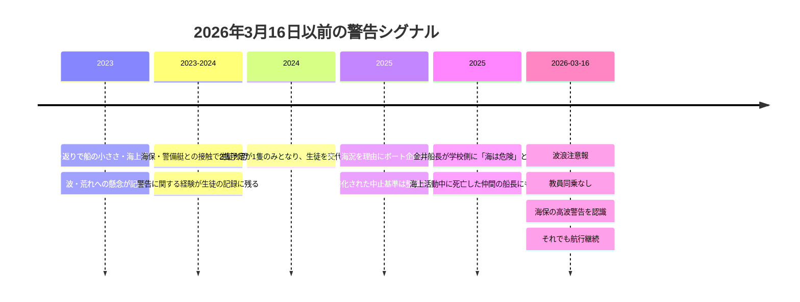

# JP-03 — 辺野古・同志社国際高校 研修旅行ボート転覆事故

**Project Blackbird 公開レポート**  
**調査基準日:** 2026年9月21日  
**ステータス:** 公開情報調査として一旦クローズ。JTSB最終報告、検察・裁判上の処分、新たな公的資料、重要な一次証言など、実質的な新証拠が出た場合のみ再開する。

## 要約

2026年3月16日、同志社国際高等学校の沖縄研修旅行中、辺野古・大浦湾沖で小型船「不屈」と「平和丸」が転覆した。乗船していたのは生徒18人と運航側の成人3人で、教員は2隻のいずれにも同乗していなかった。17歳の武石知華さんと「不屈」の船長・金井創さんが死亡した。公開報道では、司法解剖の結果、2人の死因はいずれも溺死とされている。

Project Blackbirdは、この活動がなぜ学校の継続的な教育プログラムに組み込まれたのか、どのような安全管理が存在したのか、事故前・当日にどのような警告サインがあったのか、そして公開資料から何を結論づけられ、何を結論づけられないのかを調査した。

最も強く裏付けられる結論は、陰謀ではなく、**デューデリジェンス不足、リスクガバナンスの弱さ、海上運航責任の曖昧さ、監督不足、そして危険増大に十分対応しなかった当日の意思決定が連鎖した事故**というものである。同志社の特別調査委員会はさらに踏み込み、学校の安全管理体制上の不備を「本件事故発生の最大の原因」と明記した。

ただし、すべてが解明されたわけではない。特別調査委員会は同志社側の学校運営・安全管理を調べるために設置されたもので、全関係者の民事・刑事責任を確定する機関ではない。転覆の技術的原因は運輸安全委員会（JTSB）、個人の刑事責任は海上保安庁・検察・裁判所の領域に残る。

また、米軍が事故を引き起こしたことを示す証拠は確認できない。辺野古基地問題は教育活動の背景を説明するが、公開記録で確認できる運航・安全上の意思決定は日本側の学校・運航関係者によるものである。

## 視覚的エビデンス・マップ

以下の図表は、事故の意思決定点と証拠上の境界を圧縮して示したものです。詳細な認定の代替ではなく、公開資料に基づく要約です。

### 事故当日の流れ

```mermaid
flowchart LR
    A["波浪注意報が発令中"] --> B["18名が不屈・平和丸に乗船"]
    B --> C["引率教員は同乗せず"]
    C --> D["出航判断を運航側に大きく依存"]
    D --> E["海上保安庁が高波への注意を呼びかけ"]
    E --> F["警告を認識した後も航行継続"]
    F --> G["生徒が恐怖・海況悪化を訴える"]
    G --> H["10:10頃 不屈が転覆"]
    H --> I["約2分後 平和丸も転覆"]
    I --> J["生徒が自ら通報 / 救助開始"]
    J --> K["武石知華さんを転覆した平和丸内で発見"]
```

### 事故前の警告シグナル蓄積

### 責任・コントロールのマトリクス

| 機能 | 学校・教員 | 運航側 | 旅行会社 | 規制・捜査機関 |
|---|---|---|---|---|
| コース選定 | 辺野古ボートコースを選定・継続 | 海上活動を提案・提供 | ボート企画は通常の管理外 | — |
| 運航資格確認 | 同等の海上DDを完了せず | 船舶を運航 | 当該企画を手配・管理せず | 国交省が後に必要な事業登録欠如を認定 |
| 天候 / 出航判断 | 注意報を前提とした明確な停止基準なし | 実質的な出航判断が金井船長に集中 | 管理外 | 海保が後に高波への注意を呼びかけ |
| 船上監督 | 教員同乗なし | 船長・乗員が実務上の管理を担う | 管理外 | 特別調査委員会は学校側の船上安全管理なしと認定 |
| 航路 / 操船 | 学校側による明確な航路管理なし | 船長間でも具体的航路の合意なし | 管理外 | 技術的因果はJTSBの領域 |
| 緊急対応 | 学校側の船上機能は弱い | 誤った海保電話番号が伝えられたとされる | 管理外 | 海保が救助・捜査 |
| 事故後の説明責任 | 特別調査委員会、人事対応、安全管理室 | 運航側の行為は捜査対象として継続 | — | 海保・検察・JTSB |

### 確認済み / 未解明

| 公開情報で確認済み | 未解明・非公開 |
|---|---|
| 波浪注意報が発令されていた | 海保による生還者聴取記録の全体 |
| 引率教員は同乗しなかった | 法医学・司法解剖の詳細 |
| 海保の高波警告があり、認識された | 2隻目転覆の正確な技術的メカニズム |
| 警告後も航行が継続された | 武石さんがどのように船内に取り残されたかの詳細 |
| 1隻目転覆前に生徒が恐怖を訴えた | 個人の最終的な刑事責任 |
| 国交省は必要な旅客運送事業登録がなかったと認定 | 民事責任・和解の最終状況 |
| 特別調査委員会は学校の安全管理上の不備を最大の原因とした | JTSB最終技術調査結果 |

### 遺族の3つの問い — 証拠上の回答

| 問い | 現時点の回答 | 確度 | 主な残存ギャップ |
|---|---|---|---|
| なぜ生徒はこの船に乗せられたのか | 信頼関係に基づく教育上のつながりが、十分な海上事業者DDを伴わない独自の海上活動へ発展したため。 | 高 | 学校内部の完全な意思決定・選定資料は非公開 |
| なぜ教員は同乗しなかったのか | 明確な教員同乗ルールがなく、両引率教員が船上監督なしでの出航を受け入れたため。 | 高 | 教員個々の主観的理由にはなお食い違い |
| なぜ武石さんは亡くなったのか | 公開報道では司法解剖により死因は溺死。制度・運航上の安全失敗が連鎖した中で事故が発生した。 | 中〜高 | 船内取り残し、外傷の寄与、転覆の技術的詳細は未公開 / 未確定 |

## 3つの中心的な問い

### 1. なぜ生徒はこの船に乗ることになったのか

ボート活動は、通常の旅客船事業者選定のような調達・審査プロセスを経て導入されたものではなかった。

金井氏は牧師であり、学校の辺野古学習に長く関わっていた人物でもあった。金井氏が海上から現場を見ることを提案し、教員側が教育的価値を認め、「独自プログラム」として採用した。

旅行会社はこのボート活動を手配・管理しておらず、学校側も、旅行会社の通常の安全管理に代わる同等の海上安全確認システムを構築していなかった。

公開資料からは、以下について体系的に比較・検証した形跡は確認できない。

- 正式な旅客運送事業者の比較
- 船舶の適合性
- 航路
- 出航・中止基準
- 緊急時対応
- 保険範囲
- 必要な乗組・監督体制

国土交通省は後に、金井氏が海上運送法上の登録を要する形で生徒・教員を繰り返し運送していたにもかかわらず、その登録を得ていなかったと判断し、2026年5月22日に海上保安庁へ告発した。

したがって、最も妥当な説明は次の通りである。

> 既存の信頼関係と教育上の親密さが、本来必要だった独立した海上運航事業者としてのデューデリジェンスの代わりになってしまった。

責任回避や規制逃れを目的として意図的にこの構造が作られたことを示す公開証拠はない。

### 2. なぜ教員なしで出航したのか

学校には、教員が必ず乗船しなければならないという明確なルールがなかった。

教員側の説明には食い違いがあったが、複数の生徒は、2人の教員が陸上で一緒に見送り、手を振っていたと証言した。特別調査委員会は、両教員が教員不在のまま出航することを受け入れたと判断した。

事故から半年後の報道では、さらに重要な生徒側の認識が明らかになった。ある生徒は遺族に対し、教員から見える範囲で活動すると思っていたが、船が予想以上に遠くへ進み、教員が見えなくなったことで「本当に大丈夫なのか」と不安になったと話したという。

したがって問題は単に「教員が船にいなかった」というだけではない。

> 船が岸を離れた時点で、学校側による船上の安全管理機能そのものが存在しなくなった。

特別調査委員会も、同志社側が船内の生徒安全管理を船長・運航側に全面的に委ね、学校として船上安全管理を行っていなかったと認定している。

### 3. なぜ知華さんは亡くなったのか

大きな因果の流れはかなり明らかになっているが、医学的・技術的な最終メカニズムは完全には公開されていない。

確認されている主な事実は以下の通りである。

- 名護市には波浪注意報が出ていた
- 学校には「注意報」時の明確な中止基準がなかった
- 教員間で注意報情報が適切に確認・共有されていなかった
- 実質的な出航判断は金井氏に委ねられた
- 教員は乗船しなかった
- 船長間で具体的な航路合意がなかった
- 海上保安官が途中で「波が高い」と警告した
- 金井氏はその警告を認識した
- それでも航行は継続された
- その後、生徒は海況悪化と恐怖を訴えた
- 午前10時10分ごろ「不屈」が転覆
- 約2分後、救助に向かった「平和丸」も転覆
- 知華さんは後に転覆した「平和丸」の内部で発見された

公開報道では、司法解剖により死因は溺死とされた。特別調査委員会が引用する消防記録では、発見時に救命胴衣がずり上がる、または船体構造にかかった状態であったことが記載されているが、詳細な司法解剖報告書そのものは公開されていない。

遺族は、遺体には目に見える傷だけでなく衣服で隠れる部分にも多くの傷があったと語っている。しかし、傷の種類、発生時点、原因、死因への医学的寄与は公開情報では確定できない。

したがって、現時点で最も正確な整理は次の通りである。

> 公開資料上の法医学的死因は溺死であり、その死亡は学校・運航双方の安全管理上の問題が積み重なった事故の中で生じた。ただし、知華さんが具体的にどのように船内に取り残されたのか、外傷がどの程度影響したのか、第2船の転覆メカニズムの細部は公開情報では未解明である。

## プログラム導入と事故前の警告サイン

辺野古の現地学習自体はボート導入以前から存在していた。船による見学は金井氏の提案を受けて加えられた。

事故以前には、正式な再検証を促すべき複数の出来事が存在した。

- **2023年:** 生徒の振り返りに「船が想像より小さい」「海で使うには不安」「波や揺れが強かった」といった趣旨の記載があった。少なくとも2人の教員が目にしたが、正式な海上安全再評価にはつながらなかった。
- **2023～2024年:** 海保・警戒船との接触や拡声器による警告が生徒の不安につながった。教員内で話題にはなったが、継続的な安全管理上の課題として引き継がれなかった。
- **2024年:** 2隻が予定されていたが「不屈」1隻しか来ず、17人の生徒が交代で乗船した。2隻目が来なかった理由は正式に確認されなかった。
- **2025年:** 雨・海況によりボート活動が中止されたが、書面による中止基準は作られなかった。
- **2025年:** 金井氏自身が、海は危険であり安全への注意が必要で、海上活動の仲間が死亡したこともあると学校側に話していた。

重要なのは、これらの一つ一つが2026年の転覆を予言していたということではない。

> 海上リスクを示す複数の兆候が積み重なったにもかかわらず、活動そのものを正式に再審査する仕組みが働かなかった。

## 事故当日のリスク連鎖

事故当日の状況は、一つの判断ミスではなく連続した判断として見る必要がある。

1. 波浪注意報が発表されていた。
2. 学校に「注意報」の場合の統一ルールがなかった。
3. 教員は海況を独自の基準で確認していなかった。
4. 金井氏が「海は穏やか」と説明し、実質的な出航判断を行った。
5. 教員は誰も乗船しなかった。
6. 船長間で具体的な航路合意がなかった。
7. 09時48分ごろ、海上保安官が「本日は波が高いので十分気を付けてください」と繰り返し警告した。
8. 金井氏は手を挙げて警告を認識した。
9. 航行は継続された。
10. 生徒が一部区間で操船を体験した。
11. 生徒証言では、かなりの速度が出ていて怖かったという。
12. 帰路では海の色が濃くなり、波が荒れ、速度も上がったと証言されている。
13. 大きな波が近づくのを見て生徒が叫んだ。
14. 「不屈」が転覆した。
15. その救助に向かった「平和丸」も約2分後に転覆した。

ABC/テレビ朝日系の報道で紹介された生徒証言は、特別調査委員会より前に報じられており、後の委員会認定と重なる点が多い。速度、恐怖、操船体験、海況悪化、転覆直前の大波などである。

公開証拠からは、金井氏が海保の高波警告を受け、それを認識したうえで活動を継続したことは確認できる。しかし、本人の主観的な意図や心理状態、刑事責任までは判断できない。

## 生徒監督と緊急対応

全生徒は救命胴衣を着用していたが、特別調査委員会は説明・装着指導にばらつきがあり、学校として統一的な海上緊急時教育を行っていなかったとした。

事故後の通報でも生徒が大きな役割を果たした。

- 複数の生徒が自ら海保へ118番通報した
- 運航側の成人から誤った海保の電話番号を伝えられた場面があった
- 生徒は水中で激しく回転させられる、上下が分からなくなる、繰り返し波に飲まれる、船体や海底に挟まれるなどの体験をしている

第11管区海上保安本部は、その後、生存した17人全員から保護者同席で事情聴取を行い、生徒が撮影した映像も入手したと報じられている。

Project Blackbirdは、第11管区海上保安本部および中城海上保安部の公開サイトを調査したが、その事情聴取記録そのものが公開されているデータベースやページは確認できなかった。

## 知華さんのコース変更希望

特別調査委員会報告書により、知華さんが旅行前に辺野古コースから他コースへの変更を希望していたことが判明した。

変更希望者が多く、抽選の結果、知華さんは辺野古コースに残ることになった。

これは重要な事実であるが、**なぜ変更を希望したのか**は公開資料では分からない。

「安全面が不安だったから変更した」と結論づけることはできない。

確認できるのは、変更を希望し、結果として変更できなかったという点までである。

## 保護者への情報提供

保護者には、船の大きさ、抗議活動での使用実態、航路、事業登録の有無、教員の乗船予定、海上専用の安全管理体制などについて十分な具体的説明がなされていなかった。

特別調査委員会は、参加判断に必要な説明義務が十分果たされていなかったと認定した。

遺族は、知華さんが一般に「抗議船」と認識される船に乗ることを事前に理解していなかったと述べている。

ただし、意図的な隠蔽があったことまでは現在の公開記録からは確認できない。

船の政治的・運動上の性格は、説明責任や教育ガバナンスの問題としては重要であるが、転覆原因そのものとは分けて扱う必要がある。

## 家族への連絡の遅れ

事故後の連絡は明確なガバナンス上の問題として残る。

12時18分ごろまでに学校側は、知華さんが心肺停止状態で搬送されたことを把握していた。死亡確認は12時29分ごろ。

しかし、家族は学校からの正式連絡より先に、同乗していた生徒の保護者から知華さんが病院へ運ばれたことを知った。

この経緯は、遺族の説明と特別調査委員会の時系列の双方で確認できる。

したがって、学校の正式な連絡が、生徒・保護者の非公式ネットワークより遅れたことは強く裏付けられる。

一方で、意図的に家族への連絡を遅らせたことを示す証拠はない。

## 学校側の対応と改革

事故後、同志社は複数の改革措置を取った。

- 外部専門家による特別調査委員会を設置
- 7月31日に調査報告書を公表
- 7月、業務上過失致死傷容疑等に関連して第11管区海上保安本部による学校への家宅捜索
- 理事長が一連の責任を踏まえ辞任意向を表明
- 同志社国際中高の校長を8月31日付で解任
- 9月1日に法人内「安全管理室」を設置
- 高リスク活動の事前審査・承認、統一安全基準、モニタリング、是正指示、教職員研修などを新制度化
- 2026年度の沖縄研修旅行を中止
- 教育の中立性・適切性を検討する別委員会の設置を予定

これらは、法人が従来の安全管理体制に抜本的な改善が必要だと判断したことを示す。

ただし、各改革措置そのものを、すべての法的責任を認めた「自白」と扱うことはできない。

## 政治・教育上の論点

辺野古は政治的対立の強い場所であり、船と主要運航関係者は基地建設反対の海上活動に関係していた。

文部科学省は2026年5月22日、この教育活動の実施方法について教育基本法14条2項の観点から問題があると判断し、政治的中立性・適切性の検証を求めた。

この論点は事故の安全原因とは分離する必要がある。

現在の証拠からは、事故当時、生徒自身が抗議行動の操船・実力行動を行っていたとは確認できない。また、米軍関係者や米軍活動が転覆を引き起こしたことを示す証拠も確認できない。

## 公開証拠から確認できないこと

Project Blackbirdでは、以下を立証する信頼できる公開証拠は確認できなかった。

- 学校が意図的に生徒を危険へさらしたこと
- 同志社・反基地団体・米側当局による陰謀
- 家族への事故連絡を意図的に隠したこと
- 教員が生徒に事故映像の削除を命じたこと
- 特定個人の刑事過失が最終的に法的確定したこと
- 知華さんが安全不安を理由にコース変更を希望したこと
- 外傷が溺死ではなく医学的死因だったこと
- 民事上の最終和解・補償内容
- JTSBの最終技術原因報告
- 調査基準日時点での最終的な検察処分

## 責任構造の整理

### 同志社国際高校・学校法人同志社

公開資料上、特に強く確認できる問題は以下である。

- 事前リスク調査の不足
- 生徒・保護者への説明不足
- 校外活動における安全ガバナンスの弱さ
- 注意報時の出航・中止基準の欠如
- 船上での学校側監督の不存在
- 独自プログラムに対する独立安全確認の不足
- 過去の警告サインのエスカレーション不足

特別調査委員会は、学校の安全管理上の不備を「本件事故発生の最大の原因」と明記した。

### 金井氏・運航側

公開資料で確認できる主な問題は以下である。

- 国交省が必要と判断した旅客運送事業登録なしでの運送
- 出航可否判断が金井氏に集中
- 船長間で具体的航路の合意なし
- 海保による高波警告を受け、認識
- 警告後も航行継続
- 生徒証言にある速度上昇と恐怖
- 以前の「1隻2人体制」の運用認識があったとされる中、「不屈」には運航側成人が金井氏1人だけ

これらは過失評価に関係し得るが、Project Blackbirdは刑事責任を確定しない。

### 規制・捜査機関

海上保安庁は救助と刑事捜査を担当し、JTSBは別に技術調査を担当する。

制度上、学校の組織責任、船の技術的転覆原因、個人の刑事責任は別のプロセスで評価されるため、一つの結論に混同してはならない。

## 最終整理

遺族が繰り返してきた3つの問いについて、公開情報だけでも相当程度まで答えることができる。

**なぜこの船に乗せられたのか。**  
既存の信頼関係から独自の海上教育活動へ発展した一方、専門的な旅客運送事業者としての審査や、学校側による同等の海上安全確認が十分行われなかったためである。

**なぜ教員なしで出航したのか。**  
教員同乗を義務づける明確なルールがなく、担当教員2人が教員不在での出航を受け入れたためである。

**なぜ知華さんは亡くなったのか。**  
公開報道上の法医学的死因は溺死である。事故は、学校の安全管理不足、波浪注意報、教員不在、海保による高波警告の認識、航行継続、海況悪化、2隻の転覆という連鎖の中で発生した。第2船の正確な転覆メカニズムや、知華さんが船内に取り残された詳細な経緯は、公開情報ではなお未解明である。

Project Blackbirdは、JP-03を**公開情報調査として一旦クローズ**する。

これは、公式捜査や技術調査がすべて終了したという意味ではない。

JTSB最終報告、検察・裁判上の処分、捜査記録の新規公開、重要な新証言、法医学資料などが出た場合には再開する。

## 主要資料

1. 同志社 特別調査委員会報告書（2026年7月31日）  
   https://www.doshisha.ed.jp/information/index.php?c=topics_view&pk=1785463079
2. 文部科学省 調査結果（2026年5月22日）  
   https://www.mext.go.jp/a_menu/shotou/seitoshidou/1302902_00005.htm
3. 国土交通省 海上運送法関係公表（2026年5月22日）  
   https://www.mlit.go.jp/report/press/kaiji03_hh_000224.html
4. 同志社 安全管理室の設置（2026年9月1日）  
   https://www.doshisha.ed.jp/information/index.php?c=topics_view&pk=1788242111
5. 同志社 理事長辞任意向・校長交代（2026年8月25日）  
   https://www.doshisha.ed.jp/information/index.php?c=topics_view&pk=1787646780
6. テレビ朝日/ANN 生徒聴取・生徒撮影映像報道（2026年5月16日）  
   https://news.tv-asahi.co.jp/news_society/articles/900190669.html
7. TBS/news23 生存生徒インタビュー（2026年9月）  
   https://newsdig.tbs.co.jp/articles/-/2945380
8. QAB 事故1か月・遺族取材（2026年4月16日）  
   https://www.qab.co.jp/news/20260416290581.html
9. OKITIVE 司法解剖・死因報道（2026年3月19日）  
   https://www.otv.co.jp/okitive/news/post/00015547/index.html

## 公開上の注意

本レポートは、検証済み事実、公的機関による認定、当事者の主張、報道情報、分析上の判断、仮説、不明点を区別して記述している。OSINTによる公開研究であり、司法判断または法律意見ではない。
